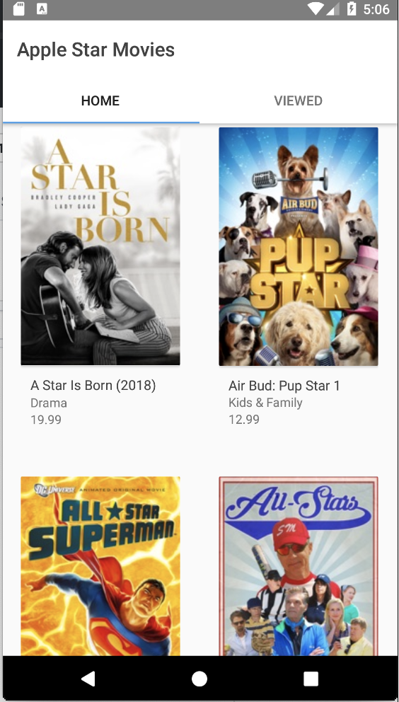
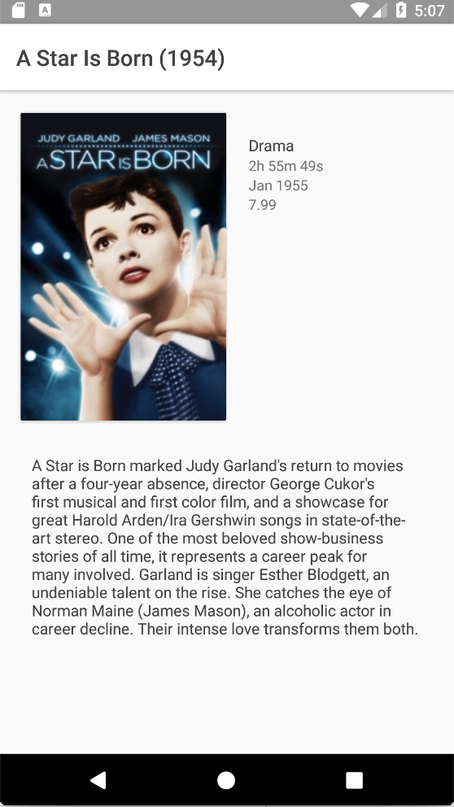
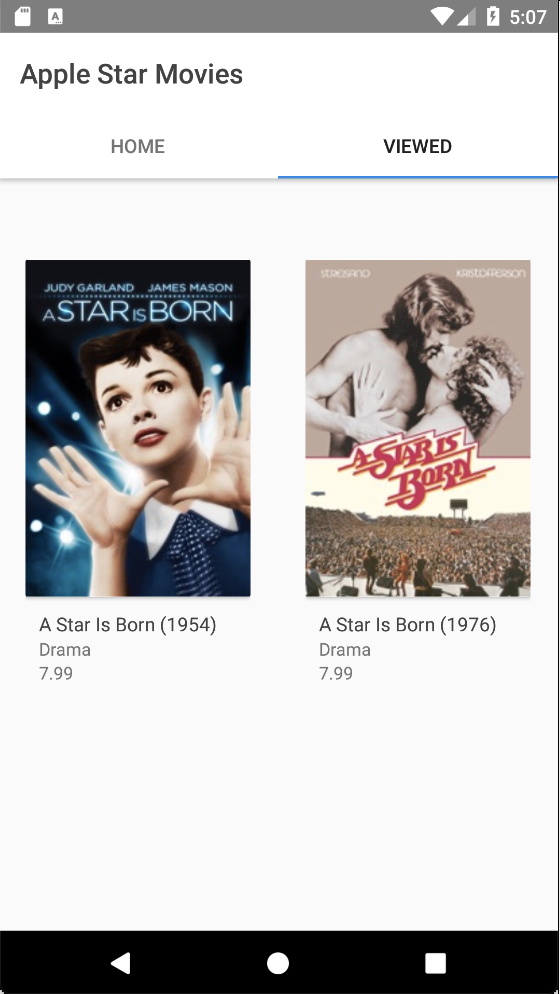

# Apple Star Movies

Simple Android App that gets Movies from the Apple API with the word Star

This app has 3 views. First is the Main Screen. On first run, or until it gets data, it retrieves data from the Apple API. It then stores the data for offline usage. 

The second view is the Detail Screen. When tapping an item from the Main View, it shows the details of the movie.  

The third view is the Viewed Screen. Here you can see what was the movies you browsed before.

## Subtle Features
 - When you back press on the Main Screen or View Screen, thus ending the app, you go back that screen when you open it again.
 - When you force close the app when in Detail Screen, you go back the Detail Screen when you open it again.
 - After closing the app, when opening it again, it shows last visit on the Main Screen list header
 - After getting data from the API, the app can be used offline
 
## API
We used the Apple iTunes API to get data. Here is the documentation:

https://affiliate.itunes.apple.com/resources/documentation/itunes-store-web-service-search-api/#searching
 
As for the query for the data, it is based on this link:

https://itunes.apple.com/search?term=star&amp;country=au&amp;media=movie&amp;all 

It's then broken down to Movies in AUS that has Star on its title. I limit the query to the maximum 200.

## Design
I tried to follow the listing in iTunes for their albums.

## Architecture used
An incomplete MVP pattern was used. Most parts are still in MVC.

## Libraries Used
### Networking
#### Retrofit
 - Easy to use and convinient
#### Picasso
 - Easy to use and has simple syntax
 
### Data Persistence
#### Room
 - My second choice. Straight forward and is made by Google.
 - First choice is Realm, but can conflict with other libs.
 
### Clean up
#### Butterknife
 - Reduce boilerplate code and cleans up code
 
#### Lombok
 - Reduces boilerplate getters and setters among other usages
## Sample
Here is the link to a sample APK: 
https://github.com/QuiteSeriousGuy/AppleStarMovies/blob/master/samples/apk/app-release.apk

## Improvements
 - Needs more images
 - Refresh
 - Can be extended to search for terms other than Star
 - Sorting function
 - Star function
